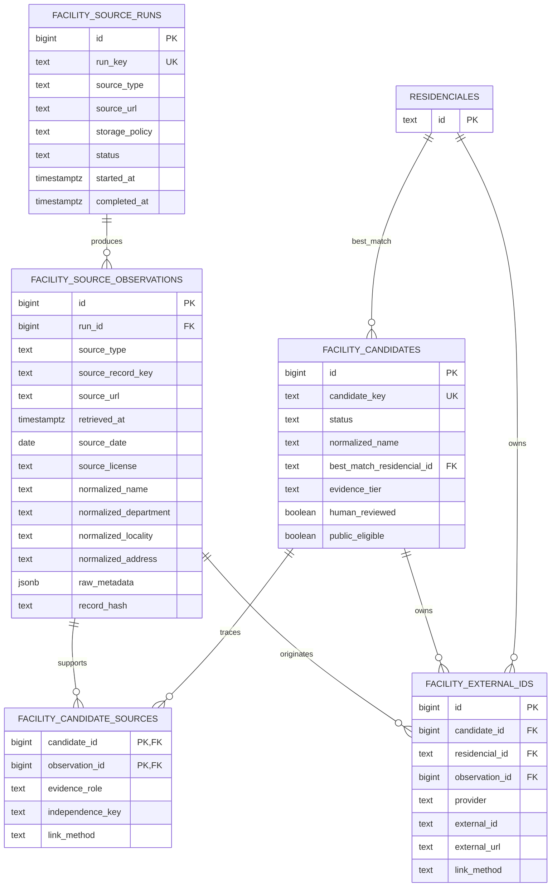

# Fase 1: esquema privado de descubrimiento

Estado: propuesto, no aplicado.

## Diagrama

Todas las tablas nuevas viven en `discovery_private`, no en `public`.

## Accesos esperados

1. Un worker aprobado escribe ejecuciones y observaciones mediante una conexión
   PostgreSQL de servidor. Los privilegios de `service_role` quedan preparados
   para uso exclusivamente servidor; nunca se expone la clave al navegador.
2. El proceso de matching crea o actualiza candidatos y vincula observaciones.
3. Una API privada de equipo, todavía no implementada, deriva la identidad de
   la sesión en el servidor y registra la revisión humana.
4. `public_eligible` solo puede activarse después de vincular evidencia A
   oficial o dos fuentes B con `independence_key` diferentes.
5. La promoción a `public.residenciales` queda fuera de esta fase y debe ser una
   acción humana separada y auditable.
6. El mapa público continúa leyendo exclusivamente `public.residenciales`.

No se otorgan privilegios a `anon` ni `authenticated`, no se crean políticas
RLS permisivas y el esquema privado no debe agregarse a los esquemas expuestos
por Data API.

## Supuestos

- `public.residenciales` existe y `id` es una clave primaria `text`.
- El rol Supabase `service_role` existe y se usa solo en servidor.
- `discovery_private` no existe todavía en la base remota; el repositorio no
  contiene otra migración que lo cree.
- Los nuevos IDs internos pueden ser `bigint generated always as identity`.
- `record_hash` es SHA-256 hexadecimal en minúsculas sobre la representación
  permitida y normalizada de cada observación.
- `source_url` es siempre una URL pública HTTP o HTTPS.
- `source_date` puede ser nula cuando la fuente no publica una fecha propia.
- `reviewed_by` y `linked_by` serán identidades derivadas por el servidor, no
  valores aceptados directamente del navegador.
- Nivel A requiere una observación oficial nominal. Nivel B requiere dos
  fuentes públicas independientes y coherentes; `independence_key` identifica
  organización o dominio, no una URL individual.
- La coherencia sustantiva de evidencia B sigue siendo una decisión humana; la
  base solo puede comprobar que existan dos claves de independencia distintas.
- Google no genera observaciones: únicamente puede aparecer como
  `provider = 'google_place'` en `facility_external_ids`, con vínculo manual,
  `place_id` y URL externa.
- Para Instagram/Facebook, `social_public_url` fuerza almacenamiento de solo
  URL, fecha de consulta y una nota humana breve.
- `raw_metadata_storage_permitted` requiere una evaluación previa de licencia,
  términos y privacidad. Nunca autoriza reseñas, autores, fotografías, datos de
  residentes, teléfonos personales, historias clínicas o denuncias.
- La tabla heredada `public.residencial_discovery_candidates` continúa sin
  cambios durante la transición y no se migra automáticamente.

## Archivos operativos

- Migración: `supabase/migrations/20260802041423_create_private_discovery_workflow.sql`.
- Rollback: `supabase/rollbacks/20260802041423_drop_private_discovery_workflow.sql`.
- Verificación local: `supabase/tests/20260802041423_verify_private_discovery_workflow.sql`.

La verificación debe ejecutarse solo después de aplicar la migración en una
base descartable, nunca con credenciales de producción. Todo dato de prueba se
crea dentro de una transacción que termina con `rollback`.
