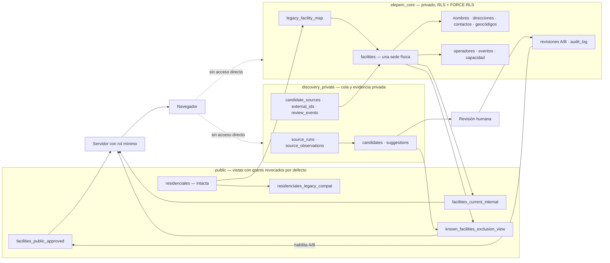
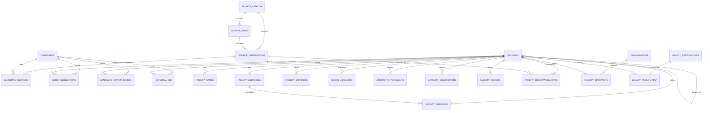
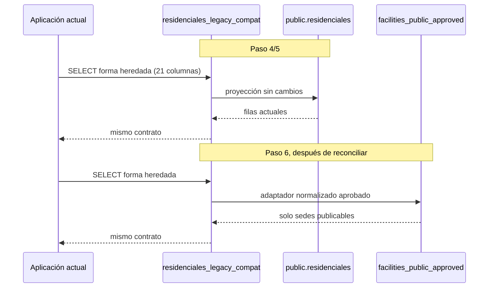

# Diagrama del esquema objetivo

Estado: diseño de Paso 4, no aplicado.

## Límites y flujo

## Relaciones principales

## Cardinalidades e invariantes

- Una sede tiene muchos nombres, pero como máximo uno preferido.
- Una sede puede tener muchas direcciones históricas, pero como máximo una dirección física actual.
- Una dirección puede tener varios resultados históricos, pero como máximo un geocódigo actual por sede.
- Una sede puede relacionarse con varios operadores históricos y con un operador actual por tipo de relación.
- Un ID externo tiene exactamente un propietario: candidato, fila heredada o sede canónica.
- Un ID heredado tiene una sola fila de mapping; mappings pendientes o conflictivos no apuntan a una sede.
- Una revisión y una entrada de auditoría son append-only.
- La vista pública solo selecciona una sede actual aprobada con una revisión humana A/B, nombre, dirección y geocódigo actuales.

## Contrato de compatibilidad

No se redefine la vista hacia el modelo normalizado hasta que el backfill demuestre equivalencia y el usuario apruebe el corte de producción.
